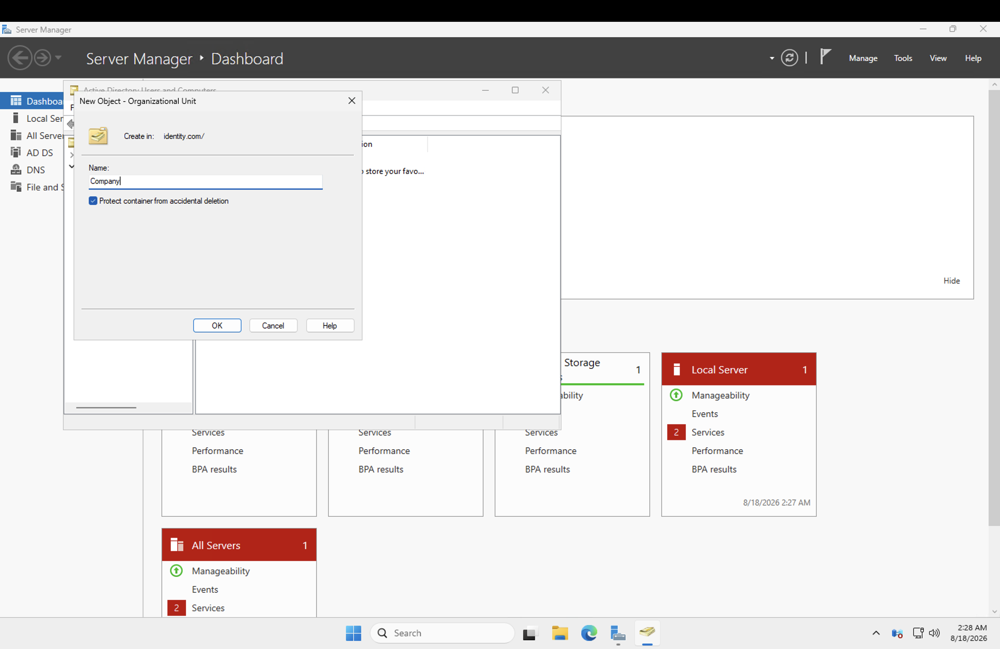
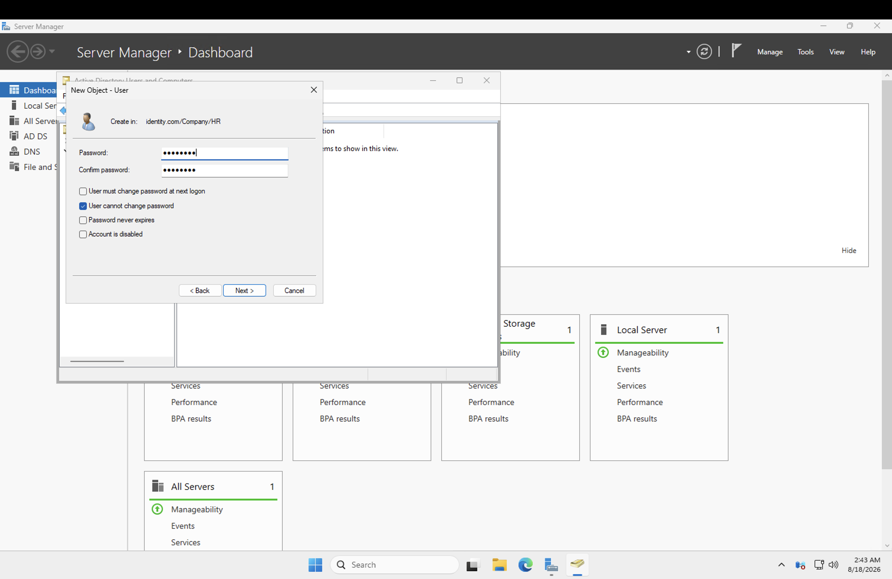
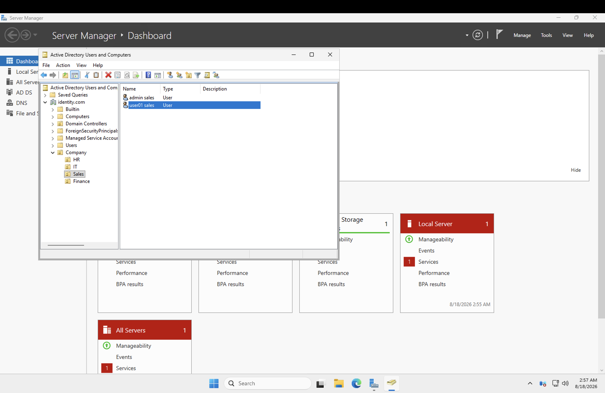
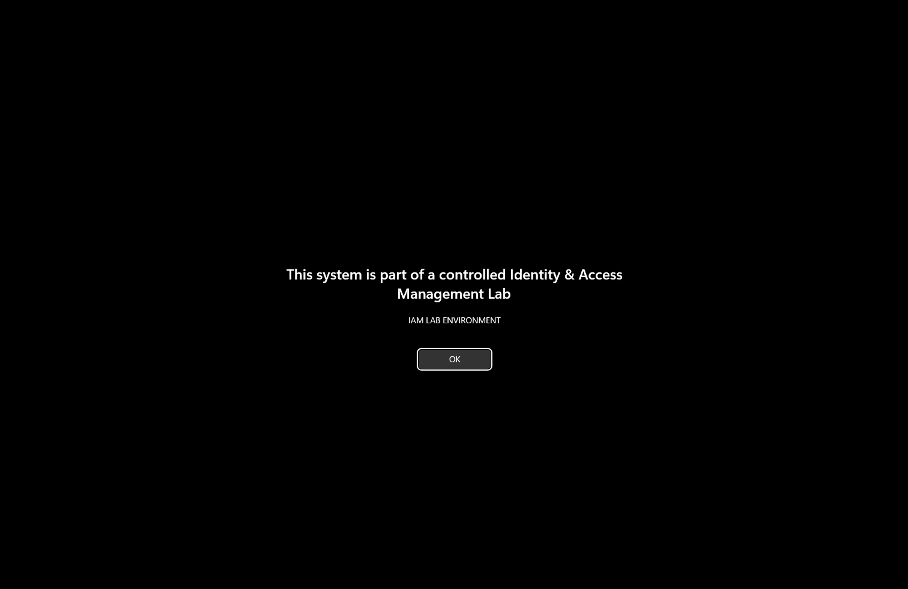
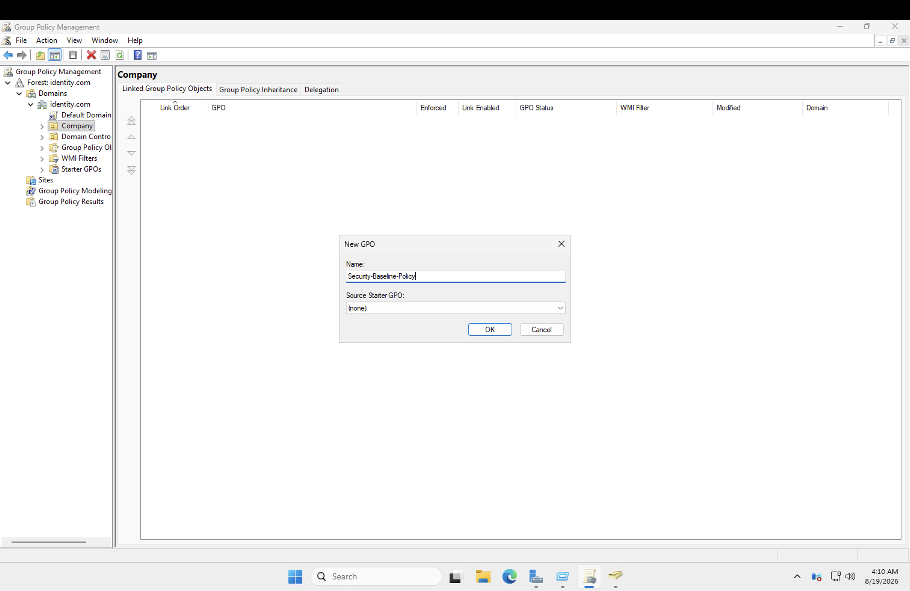
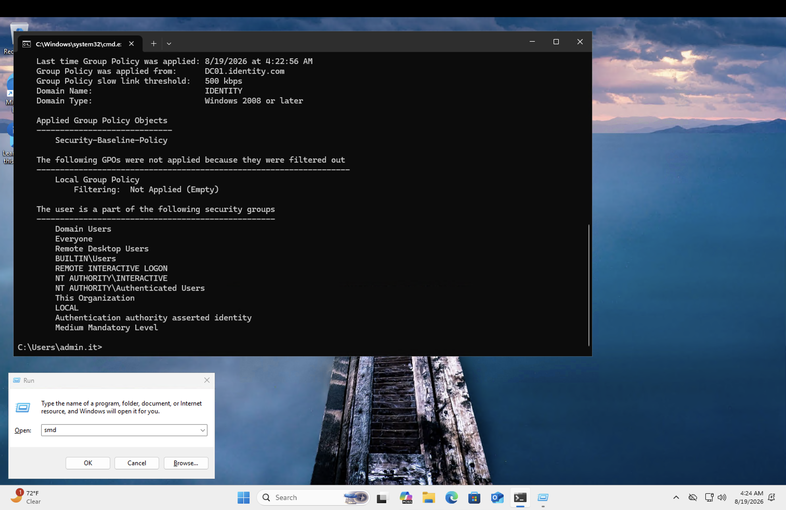

# Module 2: Active Directory — Core Identity Store

## What I did

With the lab environment up, next was building the actual identity backbone: promoting a Windows Server 2025 VM to a Domain Controller for `identity.com`, designing an OU structure, joining a Windows 11 client to the domain, and applying a baseline security GPO. Straightforward on paper — but running this on Azure instead of local VMs surfaced a category of problems the standard walkthroughs don't cover at all.

## Steps

### Installing and promoting the domain controller

Installed AD DS on the `Sever` VM and promoted it to a Domain Controller for a new forest, `identity.com`. Uneventful — this part behaved exactly as expected.

### Building the OU structure

Designed an OU layout for the organization and created accounts within it, including an IT admin account (`admin.it@identity.com`) for day-to-day management tasks.

### Joining PC01 to the domain

This is where things went sideways. The standard process is: set a static IP on the client so it can reliably reach the DC, point DNS at the DC, then join the domain. On a local hypervisor this is a non-event. On Azure, it took down the entire VM.

### The hidden WireServer route

Right after setting a static IPv4 address inside Windows, the Azure VM Agent flipped to "Not Ready" and RDP access died completely. Took a long troubleshooting session to get to the bottom of it: Azure quietly hands your VM a route to its own management endpoint (`168.63.129.16`) as a DHCP option alongside the normal IP lease. The moment you manually assign a static IP inside the guest — which disables the DHCP client — that route disappears with it, and the VM Agent loses its ability to talk to the platform entirely.

This isn't something that comes up on a local hypervisor, since host-guest management there doesn't depend on network routing at all.

Tried re-enabling the (also accidentally disabled) adapter, manually adding a persistent route back to the WireServer, disabling Accelerated Networking, and redeploying the VM to a new host. None of it reliably fixed the original VM. Ended up rebuilding the client from scratch and doing it differently the second time: **left the IP on DHCP and only set the DNS server** to point at the DC. That's all domain join actually needs — DNS resolves the domain via SRV records, the address itself doesn't need to be static. Fixed it completely.

**Takeaway:** on Azure, don't manually assign a static IP inside a guest OS. If a fixed address is genuinely required, set it at the NIC level in the Azure Portal instead (IP configurations → Static) — the guest stays on DHCP internally and keeps the hidden route intact while still always getting that same address.

### The adapter-disable lockout trap

Some setup guides have you disable and re-enable the network adapter after changing IP settings, to force the change to take effect. Doing this while connected over RDP kills the session instantly, since RDP traffic runs over that same adapter — and there's no way to click "enable" again once you're disconnected.

Fix: do this step through Azure Serial Console instead, which doesn't depend on the guest's network adapter at all. Also realized it's unnecessary when only DNS changes, since DNS updates apply immediately without needing an adapter reset.

### Domain account couldn't RDP in

After the domain join succeeded, tried logging in over RDP as `admin.it@identity.com` and got hit with `0x2407`: *"You might not have permission to sign in remotely."* Turns out RDP requires the "Allow log on through Remote Desktop Services" right specifically, which a fresh domain account doesn't have by default — console logon (interactive logon) is a separate, less restrictive permission.

Fixed by logging in as the working local admin, opening `lusrmgr.msc`, and adding `admin.it` to the local **Remote Desktop Users** group on the client machine.

### Configuring the security baseline GPO

Applied a baseline GPO to the domain once the client was stable. No surprises here — this part just worked.

---

## Skills demonstrated

- Active Directory Domain Services installation, forest/domain promotion, and OU design
- DNS-based domain discovery and troubleshooting
- Group Policy baseline configuration
- Diagnosing Azure platform-specific networking issues (VM Agent connectivity, DHCP-delivered management routes, NSG/Accelerated Networking) distinct from standard AD troubleshooting
- Out-of-band VM access and recovery via Azure Serial Console
- Windows local group management (Remote Desktop Users) for RDP access control on domain-joined machines

## Notes for next time (Azure-specific)

- Never manually set a static IP inside a guest OS — DNS-only changes, or static IP at the Azure NIC level, not inside Windows.
- RDP needs explicit permission for non-admin/domain accounts — local console access doesn't.
- Any step touching the network adapter you're connected through should go via Serial Console, not RDP.
- Give VMs a couple minutes to settle after any stop/start/restart before assuming something's broken.
- Stop VMs from the Azure Portal, not just in-guest shutdown, or you're still paying for compute.
