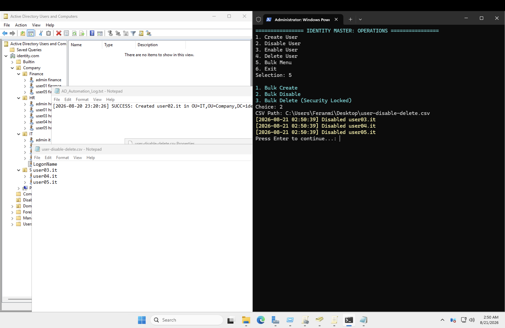
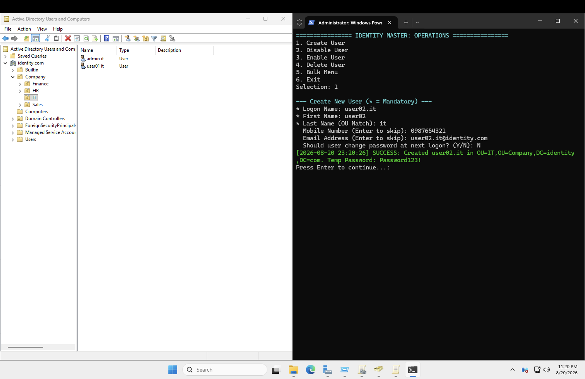
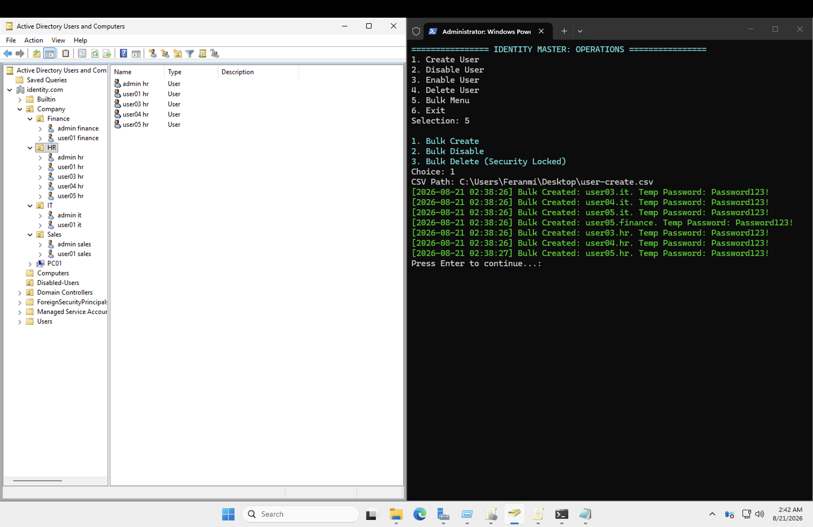
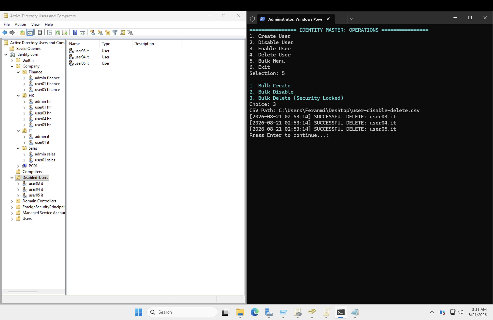
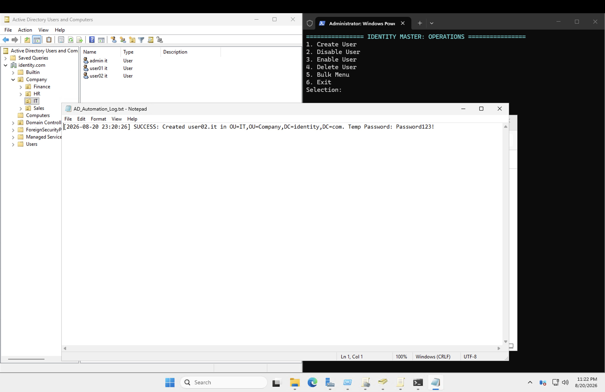
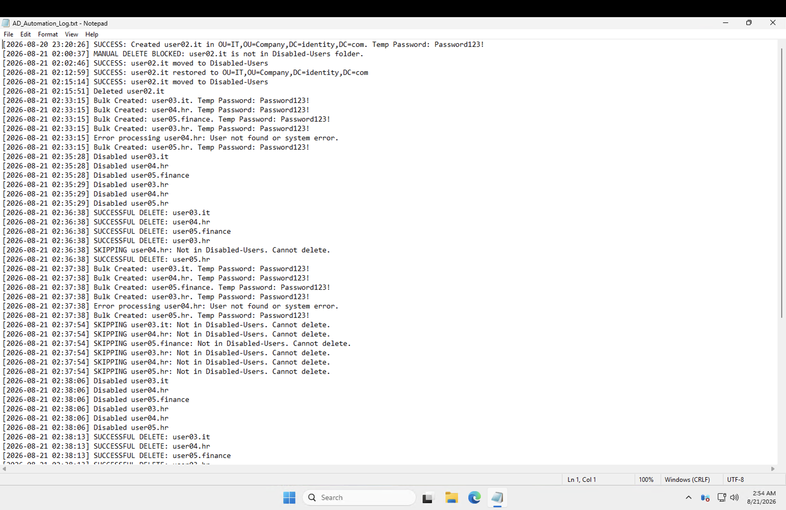

# Identity Lifecycle Management

## What I did

Next up was the actual day-to-day of identity administration: creating and deleting users, automating those operations with scripts and CSVs, and — the part that matters most in a real enterprise — disabling accounts before ever deleting them.

## Steps

### Onboarding and offboarding, the full flow

Walked through the full lifecycle: onboarding a new employee (account creation, group membership, initial setup) and offboarding one cleanly (disabling access, removing group memberships, documenting the action) rather than treating either as a single throwaway step.

### The disable-before-delete pattern

The core lesson here: never delete a user account immediately when someone leaves. Instead, disable it first and move it into a dedicated **Disabled-Users** OU, and only delete later after a retention period. This preserves an audit trail, allows for quick reversal if the offboarding was a mistake, and keeps historical access records intact for compliance — deleting immediately destroys all of that.

### Automating with PowerShell and CSVs

Built out a menu-driven identity management script (Create User / Disable User / Enable User / Delete User / Bulk operations) to handle these operations at scale instead of doing them one at a time through the GUI. Bulk operations pull from CSV files — one row per user — so onboarding a batch of new hires or disabling a batch of departures is a single script run instead of dozens of manual clicks.

### The bulk-import path error

Ran the Bulk Create option and pointed it at `C:\Users\Feranmi\Desktop` — the folder, not the file — and got `Import-Csv : Access to the path ... is denied`. Misleading error message, but the real issue was simple: `Import-Csv` needs a path to the actual CSV file, not just the folder it lives in. Fixed by pointing it directly at `C:\Users\Feranmi\Desktop\user-create.csv` instead.

### The missing OU that wasn't actually missing

After running a bulk disable, the script reported success moving a user into the Disabled-Users OU — but the OU didn't appear anywhere in Active Directory Users and Computers. Two things going on here: ADUC doesn't auto-refresh when changes happen via script (a manual refresh, or navigating away and back, is often needed to see new objects), and separately, the **View → Users, Contacts, Groups, and Computers as containers** setting controls whether certain container types even render in the tree at all. Toggling that view option is what actually made it appear.

### Reading the AD Automation log

Went through the AD_Automation_Log file the script generates on every run to see how this actually gets recorded in a real environment — timestamped entries for every create, disable, enable, and delete action, with the account name and outcome logged for each one. This is the audit trail piece that matters in practice: in an enterprise setting, nobody just trusts that a script "did the thing" — every identity operation needs a record of who/what changed, when, and whether it succeeded, both for troubleshooting and for compliance review.

---

## Skills demonstrated

- Full identity lifecycle management: onboarding, offboarding, and account state transitions
- Enterprise disable-before-delete account retention strategy
- PowerShell automation of bulk AD operations via CSV-driven scripts
- Troubleshooting `Import-Csv` path errors
- Understanding ADUC's refresh and view-rendering quirks when objects are created outside the GUI
- Reviewing automation logs to understand enterprise audit trail practices for identity operations
- Reviewing automation logs to understand enterprise audit trail practices for identity operations
