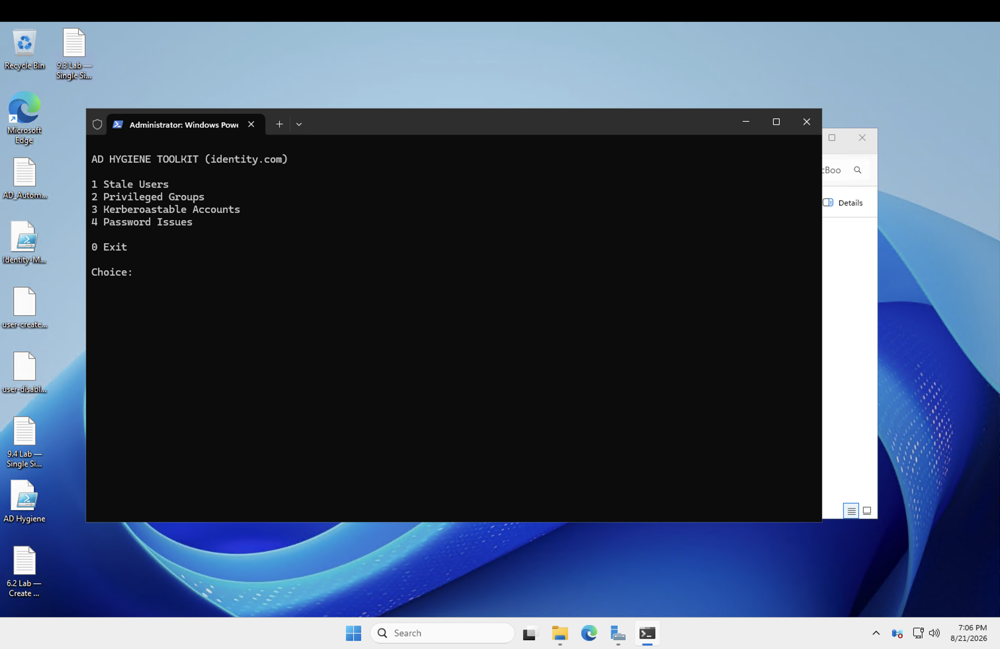
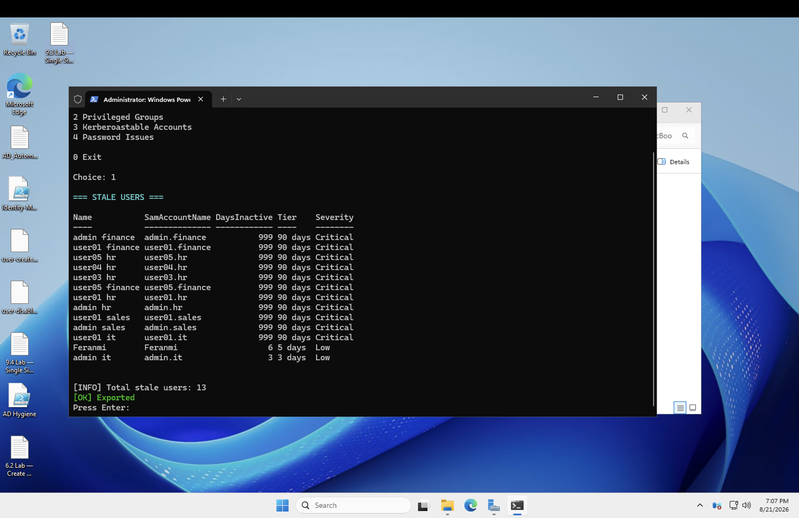
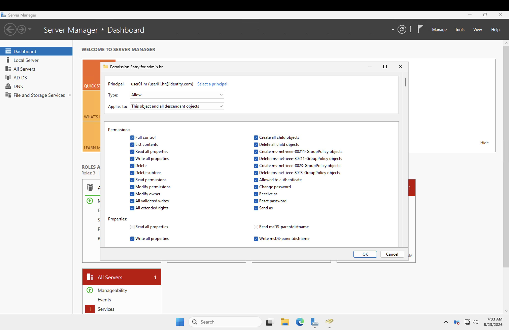
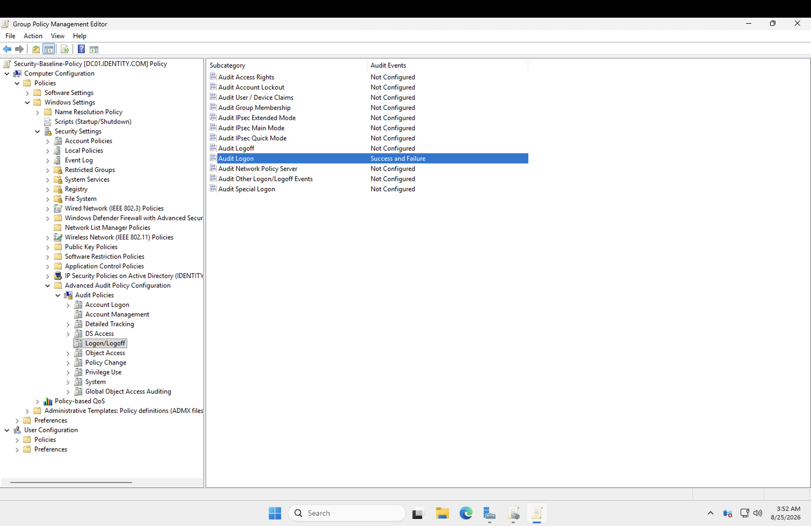
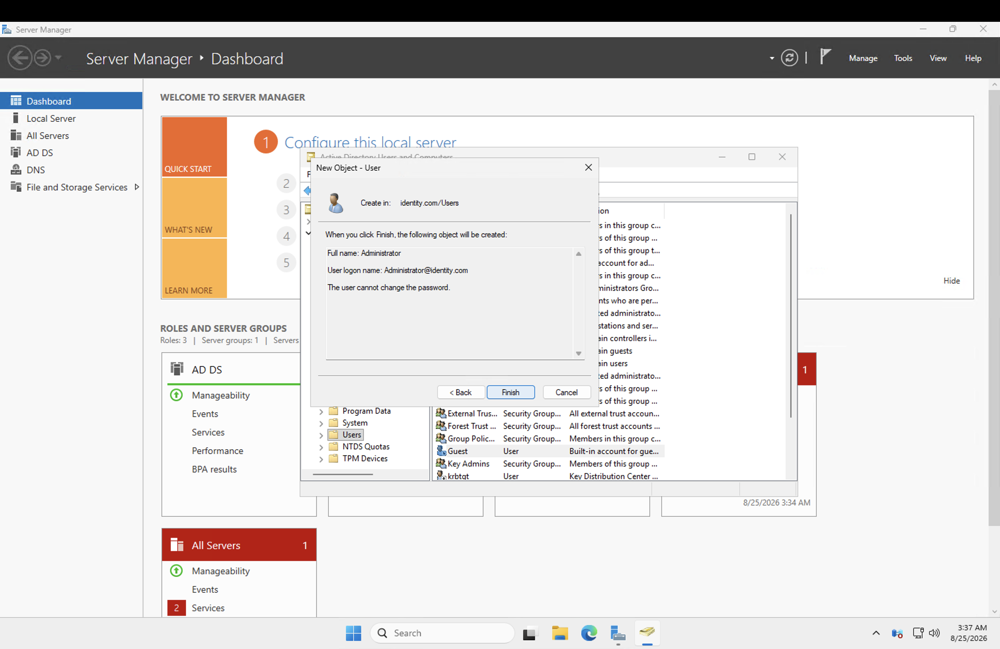
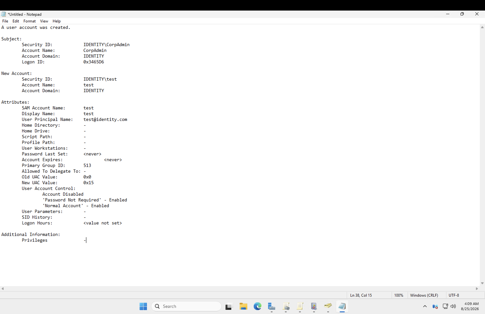

# Active Directory Hygiene

## What I did

This part focused on keeping AD clean and secure over time, not just setting it up correctly once: auditing privileged accounts, fixing ACL misconfigurations, understanding AdminSDHolder, hardening default accounts, and setting audit policies. I also went beyond the lab and built a honeypot decoy admin account as a detection tripwire, then reviewed the event logs generated by user creation to see what a real audit trail looks like end to end.

## Steps

### Auditing privileged accounts

Audited membership across the privileged groups (Domain Admins, Enterprise Admins, and similar) to flag which accounts actually hold elevated access and why. This is the same underlying question that keeps showing up across enterprise IAM: who has power, is it still justified, and when was it last reviewed.

### Fixing ACL misconfigurations and understanding AdminSDHolder

Learned about **AdminSDHolder**, the background process that periodically resets ACLs on protected/privileged accounts back to a known-good template — a safeguard against ACL drift or someone quietly granting themselves unintended permissions on a sensitive object. Worked through identifying and correcting ACL misconfigurations that would otherwise leave privileged accounts with permissions nobody intended them to have.

### Hardening default accounts and setting audit policies

Hardened the built-in default accounts every AD environment ships with (Administrator, Guest) — the classic "already a target the moment the domain exists" accounts — and configured audit policies so security-relevant actions actually get logged instead of happening silently with no record.

### Building a honeypot decoy admin account

Created a decoy account made to look like a legitimate admin account, with no real purpose behind it — nobody should ever be authenticating as it under normal operation. Any activity against it (logon attempts, password resets, group membership changes) is a strong signal something is wrong, since a real admin would have no reason to touch it. This is a cheap, low-effort detection technique: it costs almost nothing to set up, and any signal it produces is high-confidence malicious activity rather than noise to sift through.

### Reading the user creation logs

Went back through the event logs generated when new users get created, to see what a legitimate creation event actually looks like from end to end. Useful as a baseline — once you know what "normal" looks like in the logs, an account created outside business hours, or one that doesn't match the expected log signature of the automation script, actually stands out.

---

## Skills demonstrated

- Privileged account auditing across AD security groups
- Understanding and troubleshooting AdminSDHolder / ACL protection on sensitive accounts
- Hardening built-in default accounts (Administrator, Guest)
- Configuring audit policies for security-relevant event logging
- Deception-based detection design (honeypot/decoy account strategy)
- Reviewing raw event logs to establish a baseline for anomaly detection
