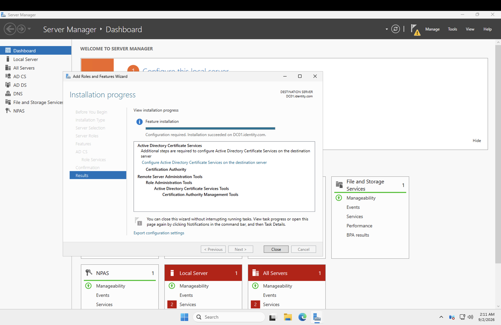
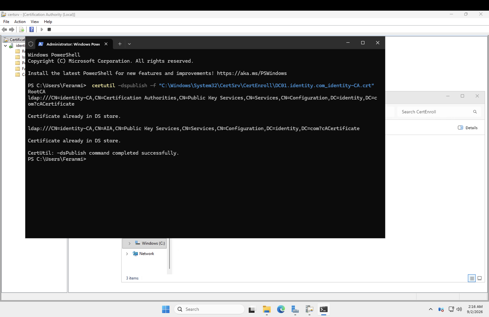
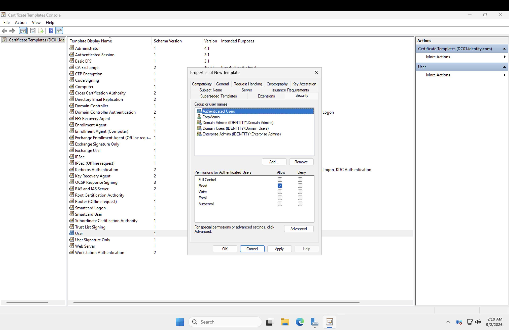
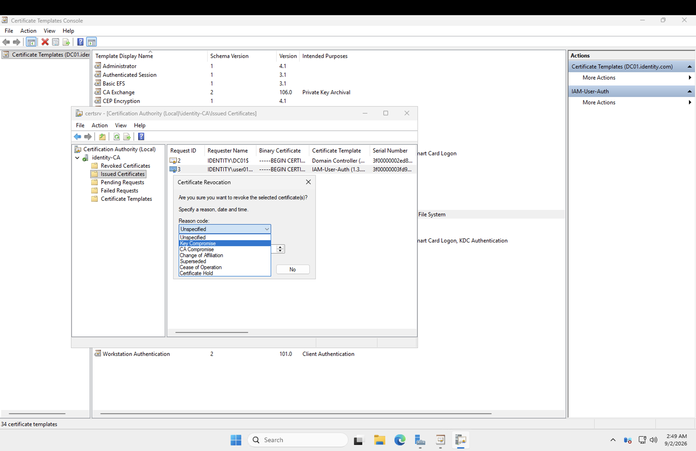
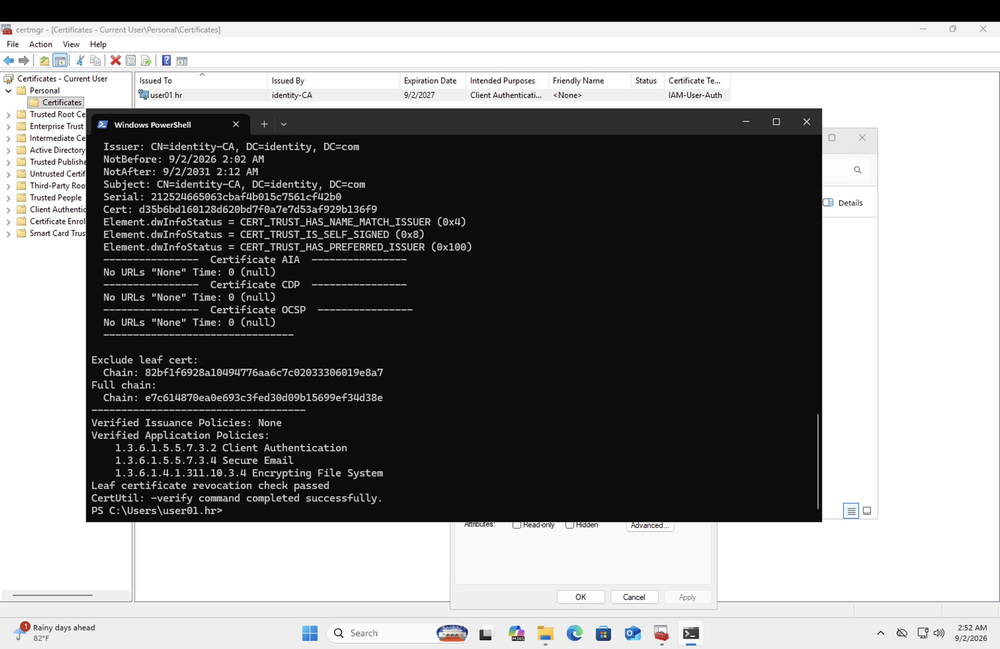
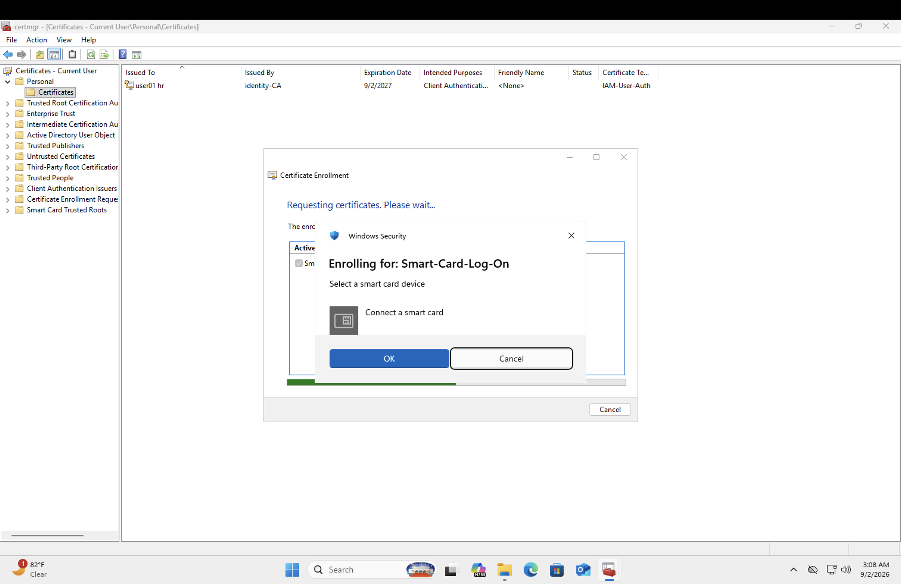

# Public Key Infrastructure (PKI) & Certificate Authority

## What I did

Built out the PKI layer of the lab: stood up an internal Certificate Authority, issued and managed certificates, worked through certificate revocation, and got certificate-based authentication working end to end — including a card-based credential that lets a user log in with a PIN instead of a password.

## Steps

### Installing and configuring AD CS

Installed and configured Active Directory Certificate Services to stand up an internal CA (`identity-CA`), so the domain could issue and trust its own certificates rather than depending on an external CA for internal-only authentication scenarios.

### Issuing and managing certificates

Issued client authentication certificates to users through the CA and worked through the actual admin side of the certificate lifecycle — mapping issued certs to specific users and purposes rather than just generating them generically.

### Revoking certificates

Issuance is only half the lifecycle. Just as important is revocation: when a certificate is compromised or should no longer be trusted, it needs to actually stop being trusted immediately, not just quietly expire on its own schedule months or years later. Went through revoking a certificate and understanding how the Certificate Revocation List (CRL) is what clients actually check before trusting a presented certificate — revocation isn't real unless something downstream is checking for it.

### Hitting a hard platform limitation on hardware-backed smart cards

Tried provisioning a TPM-backed virtual smart card directly on the Windows 11 VM and hit a wall: Windows blocks TPM virtual smart card creation over any Terminal Services (RDP) session, by design — a security measure so an attacker with RDP access can't remotely provision a virtual credential. Since an Azure VM is only ever reachable over RDP, with no true physical console to fall back to, that specific hardware-backed path is essentially a dead end on cloud infrastructure rather than something more effort would fix.

### Certificate-based logon with a PIN instead of a password

Didn't get a working smart card provisioned in the end — the RDP restriction on TPM virtual smart cards turned out to be the same wall blocking this too, and rebuilding the environment around it wasn't worth the time for a cloud lab VM with no real console to fall back to. Still worked through the concept in depth: the private key lives on the card itself and is never transmitted, so authentication becomes "something you have" (the card) plus "something you know" (the PIN), rather than a password alone. A PIN intercepted without the physical card is useless to an attacker, which is exactly why this pattern shows up in high-security enterprise environments. Understand how it's meant to work end to end, even without a completed hands-on build for this specific piece.

---

## Skills demonstrated

- Installing and configuring Active Directory Certificate Services (AD CS) as an internal Certificate Authority
- Certificate issuance and full lifecycle management, including revocation
- Understanding Certificate Revocation Lists (CRLs) as the mechanism that makes revocation actually effective
- Certificate-based authentication concepts, including PIN-based smart card logon as a password alternative (theoretical understanding; practical build blocked by the same RDP/TPM platform restriction)
- Diagnosing platform-level restrictions (TPM virtual smart card provisioning blocked over RDP) distinct from configuration mistakes
