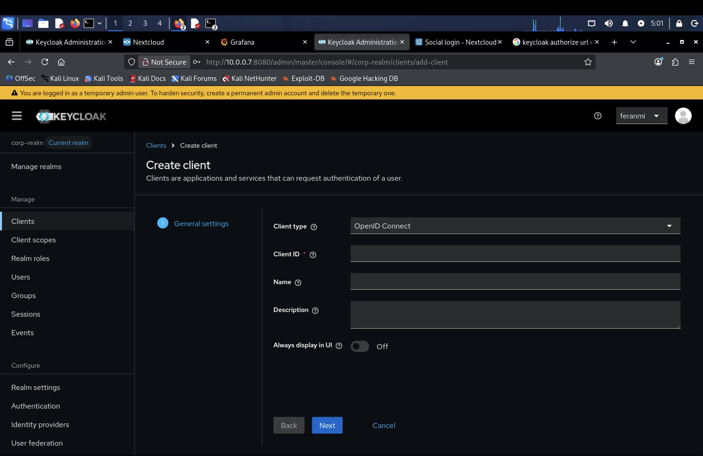
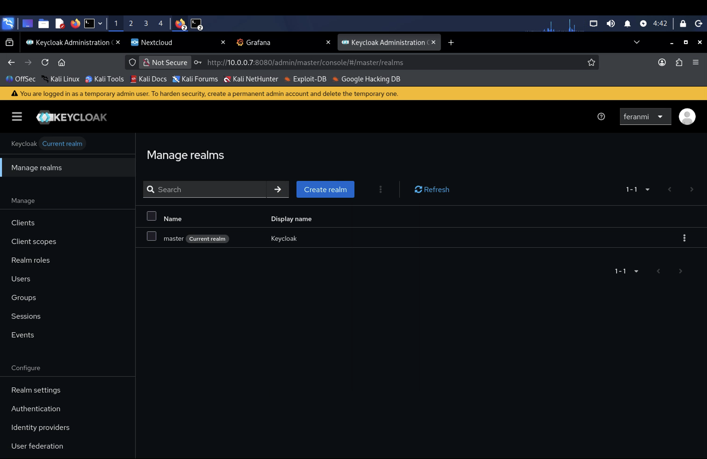
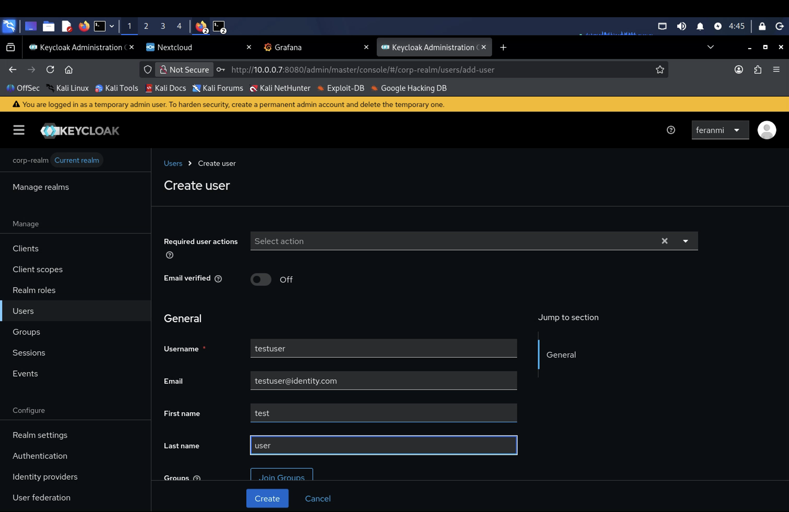
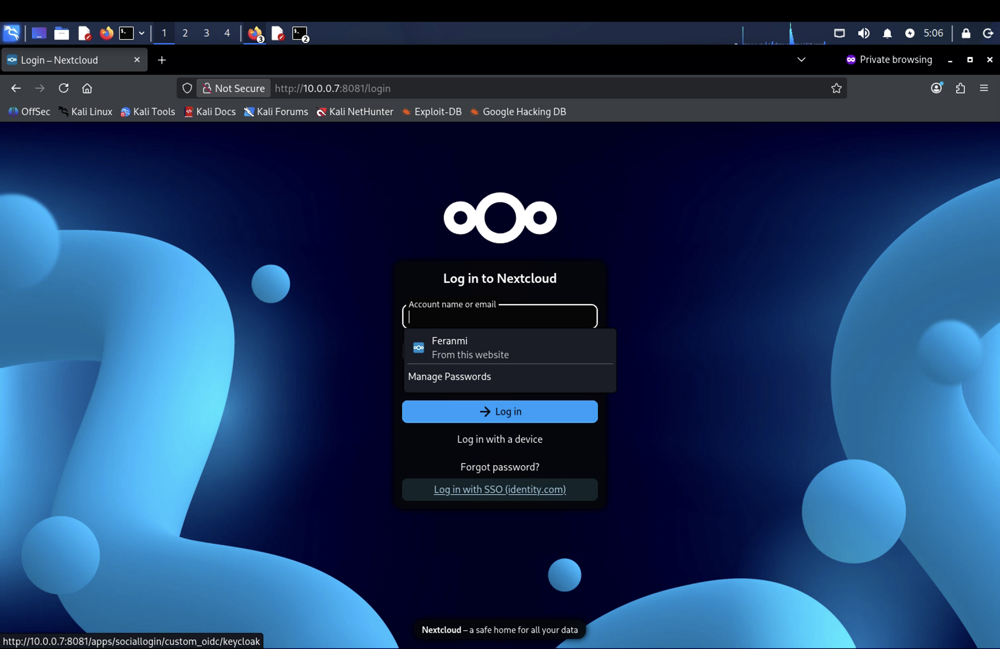
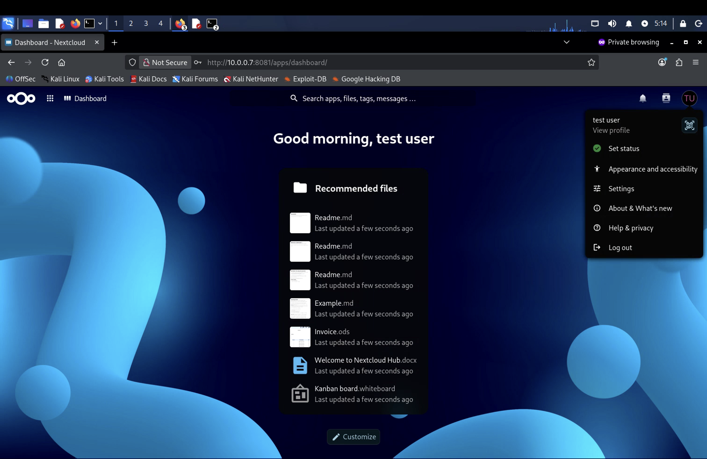
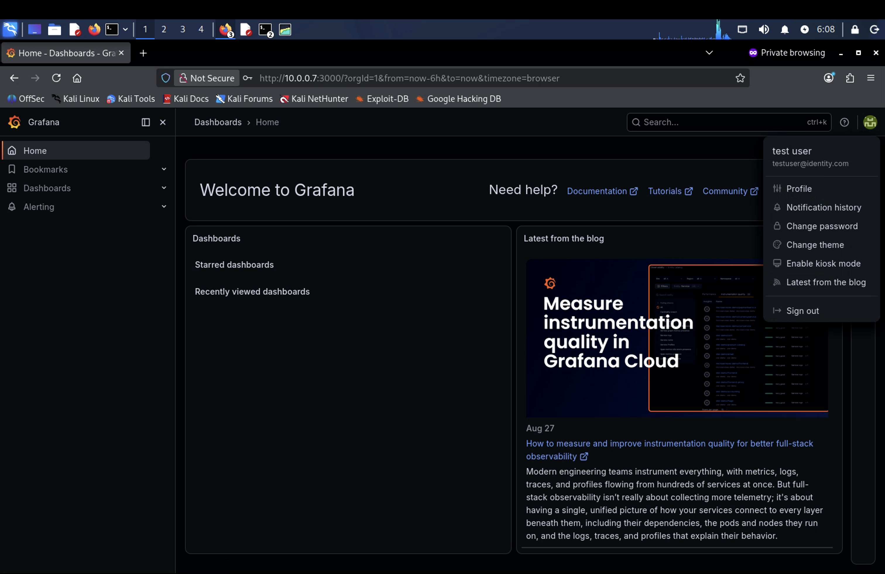
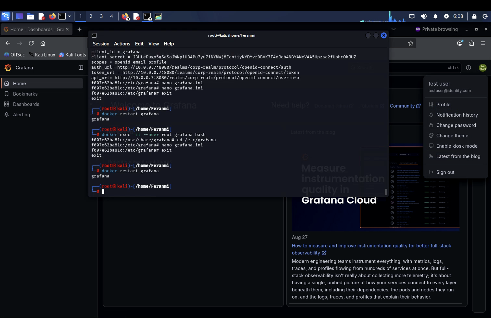

# Single Sign-On (SSO)

## What I did

Got SSO working end to end across multiple applications, using Keycloak as a central Identity Provider with Nextcloud and Grafana configured as Service Providers via OpenID Connect. Getting there meant actually understanding the protocols underneath SSO, not just clicking through a config screen, and working through a real chain of issues before login worked at all.

## Steps

### OAuth 2.0, OIDC, and SAML 2.0, and how they actually differ

Went deep on the protocols rather than treating them as interchangeable buzzwords. OAuth 2.0 is fundamentally an **authorization** framework, not authentication — it's about granting a client scoped access to a resource on a user's behalf, and on its own it says nothing about proving who someone actually is. OpenID Connect (OIDC) is a thin identity layer built on top of OAuth 2.0 that adds the piece OAuth alone doesn't have: an ID token that actually authenticates the user. SAML 2.0 is the older, XML-based alternative that handles both authentication and authorization assertions and still shows up constantly in enterprise and legacy environments, while OIDC is the newer, JSON/REST-friendly standard most modern apps use instead.

Also nailed down the Identity Provider vs. Service Provider relationship that all of this sits on top of: the **Identity Provider** (Keycloak, here) is the system that actually authenticates the user and vouches for who they are, and the **Service Provider** (Nextcloud, Grafana) is the application that trusts the IdP's assertion and grants access based on it instead of handling login itself.

### Standing up Keycloak as the Identity Provider

Deployed Keycloak via Docker and configured it as the central IdP for the lab, using a dedicated `corp-realm` rather than the built-in `master` realm — `master` is meant for administering Keycloak itself, not for real end users authenticating into applications.

### Configuring SSO for Nextcloud and Grafana via OIDC

Set up both Nextcloud and Grafana as OIDC Service Providers pointing at Keycloak. Nextcloud went smoothly. Grafana did not, and turned into the real troubleshooting exercise of this module.

### Forgotten admin credentials

Went to log into Keycloak and realized I'd never written down the admin login from initial setup weeks earlier. Recovered it by checking the actual `docker-compose.yml` file for the `KEYCLOAK_ADMIN` / `KEYCLOAK_ADMIN_PASSWORD` values baked into the Keycloak service definition, rather than needing to reset anything.

### The doubled dollar sign, again

The recovered password had a leading `$$` in the compose file. Docker Compose treats `$$` as its own escape sequence for a literal single `$`, so the actual running password only had one `$`, not two. Same underlying category of bug as an earlier bash `$$` issue from a different module (that one was PID variable expansion) — different tool, same lesson: special characters in passwords get silently rewritten by shells and config parsers, and it's worth test-echoing anything with a `$` in it before trusting what's on screen.

### The missing SSO button

Enabled OIDC login for Grafana, but the "Sign in with Keycloak" button never appeared on the login page. Root cause was a single-character typo in `grafana.ini`: `enablep = true` instead of `enabled = true`. Grafana didn't throw a visible error — it just silently ignored the entire OAuth block, since the field it needed to see wasn't the field that was actually there.

### "Client not found" — wrong realm

After fixing the typo, the button appeared, but clicking it redirected to Keycloak and failed with "Client not found." Diagnosed it by noticing Keycloak's own auto-generated `<realm>-realm` management clients (like `corp-realm-realm`) sitting in the client list — that's a tell specific to the `master` realm, and it gave away that I was looking at the wrong realm entirely. The `grafana` client had been created in `master` instead of `corp-realm`. Fixed by switching to the correct realm, creating the client there properly with the right redirect URI, and updating `grafana.ini` with the new client secret Keycloak generated for it.

---

## Skills demonstrated

- Deploying and configuring Keycloak as a centralized Identity Provider
- Configuring OIDC-based SSO for multiple Service Providers (Nextcloud, Grafana)
- Understanding OAuth 2.0, OIDC, and SAML 2.0 — what each protocol actually does and how they relate to each other
- Understanding the Identity Provider / Service Provider relationship underlying SSO architectures
- Docker and Docker Compose credential recovery and environment variable troubleshooting
- Diagnosing silent configuration failures (a typo'd config key, a realm-scoped resource mismatch) rather than ones with an obvious error message
- Recognizing shell and config escape-character pitfalls (`$$` in Compose, distinct from but analogous to bash's `$$`) as a recurring category of bug worth watching for by pattern
