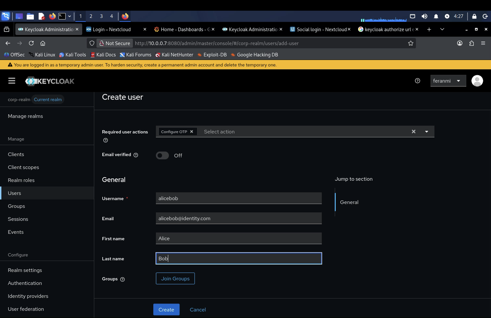
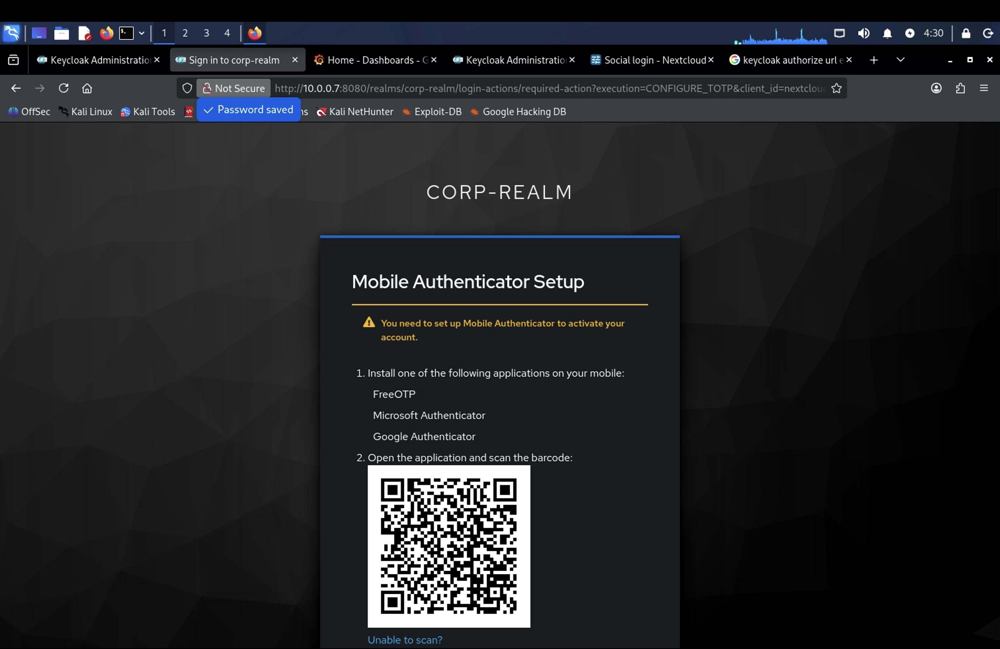
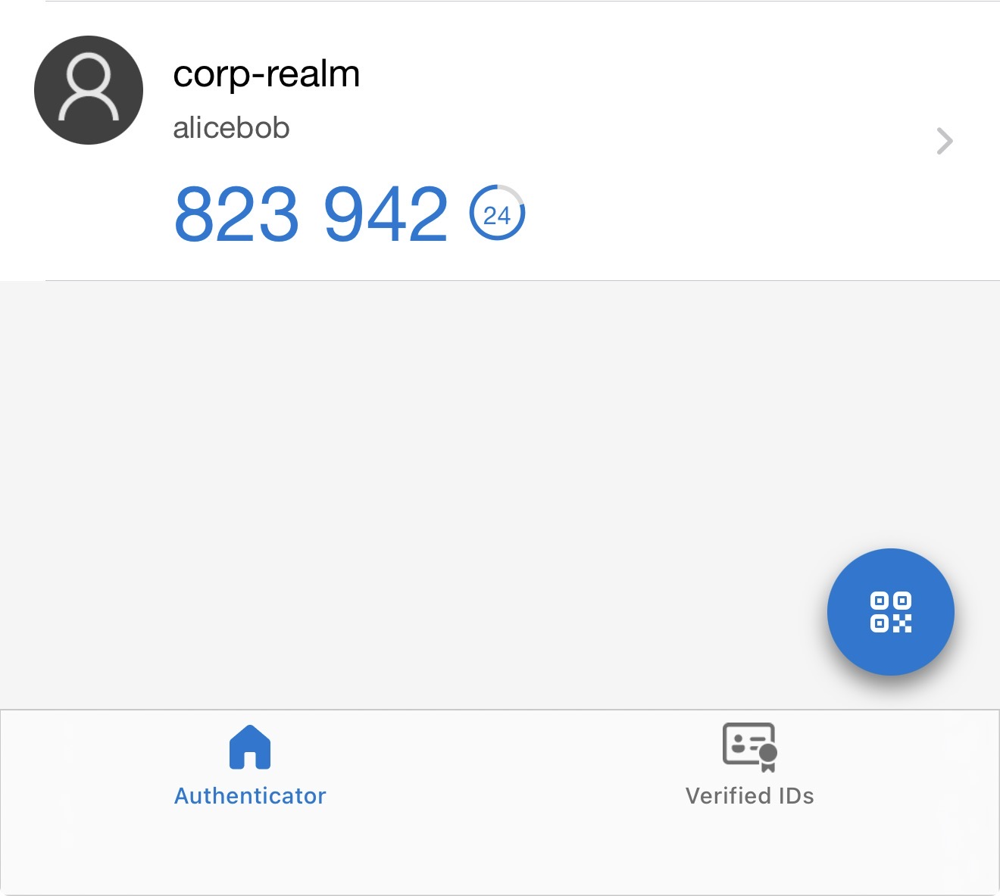
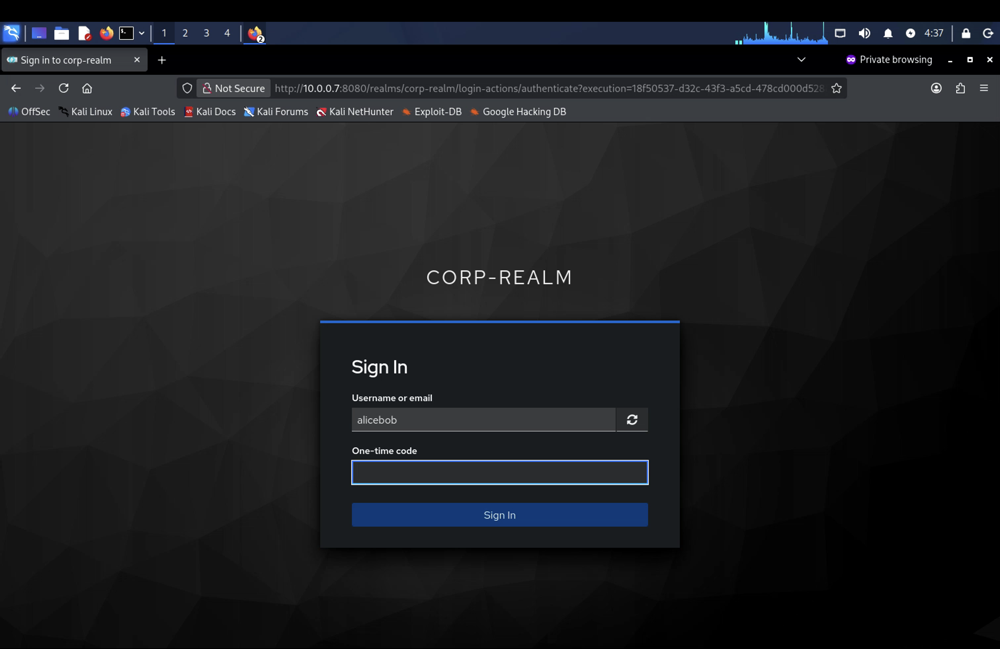

# Multi-Factor Authentication (MFA)

## What I did

Configured TOTP-based multi-factor authentication end to end: understood the mechanics behind it, set it up on Keycloak, tied it to Microsoft Authenticator as a real device, and saw it automatically extend to Grafana through the SSO integration already built in the previous module.

## Steps

### How TOTP actually works

TOTP (Time-based One-Time Password) generates a 6-digit code that changes every 30 seconds, derived from a shared secret established at setup combined with the current time — both the server and the authenticator app run the same algorithm independently and land on the same code without ever communicating directly. Worth understanding *why* this is meaningfully stronger than SMS-based MFA: no SIM-swap risk, no dependency on a carrier network, and no code sitting exposed in a text message that can be intercepted. It's a genuinely different security model, not just a different delivery mechanism for the same idea.

### Passwordless authentication as a concept

MFA and passwordless authentication get talked about together but aren't the same thing. MFA supplements a password with something else; passwordless removes the password from the equation entirely, relying instead on possession (a device, a security key, an authenticator app) and biometrics. The reasoning: the password itself is usually the weakest link — phishable, reusable across sites, guessable — so passwordless isn't about adding more layers on top of a weak foundation, it's about not depending on that foundation at all.

### Configuring OTP-based MFA on Keycloak

Set the OTP policy at the realm level, then configured an actual TOTP credential on a user account — the practical side of turning the concept into something a real login flow enforces.

### Setting it up with Microsoft Authenticator

Registered the account in Microsoft Authenticator via the setup QR code / key, then used the app's live 6-digit code to complete an actual login. This is the part that makes TOTP concrete rather than theoretical — the code in the app and the code Keycloak expects have to match within the same 30-second window, driven by the shared secret established at enrollment.

### Watching it extend to Grafana automatically

Since Grafana was already wired up for SSO against Keycloak from the previous module, enabling MFA at the Keycloak/realm level meant Grafana logins started requiring it too, without touching Grafana's configuration at all. This is the actual payoff of centralizing authentication at the IdP: enforce MFA once, and every connected Service Provider inherits it, rather than configuring MFA separately and inconsistently per application.

---

## Skills demonstrated

- Understanding TOTP algorithm mechanics and why it's meaningfully stronger than SMS-based MFA
- Understanding passwordless authentication as a distinct security model, not just "MFA with extra steps"
- Configuring OTP-based MFA policy and credentials in Keycloak
- Practical device-based MFA setup and verification using Microsoft Authenticator
- Recognizing centralized MFA enforcement at the IdP level as protection that extends automatically to every connected Service Provider
