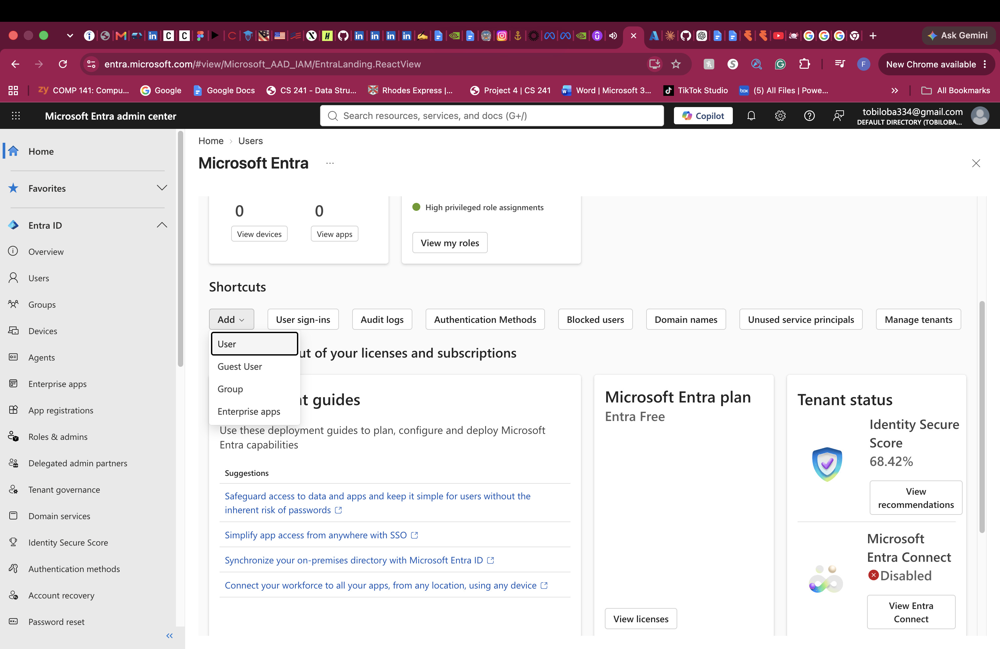
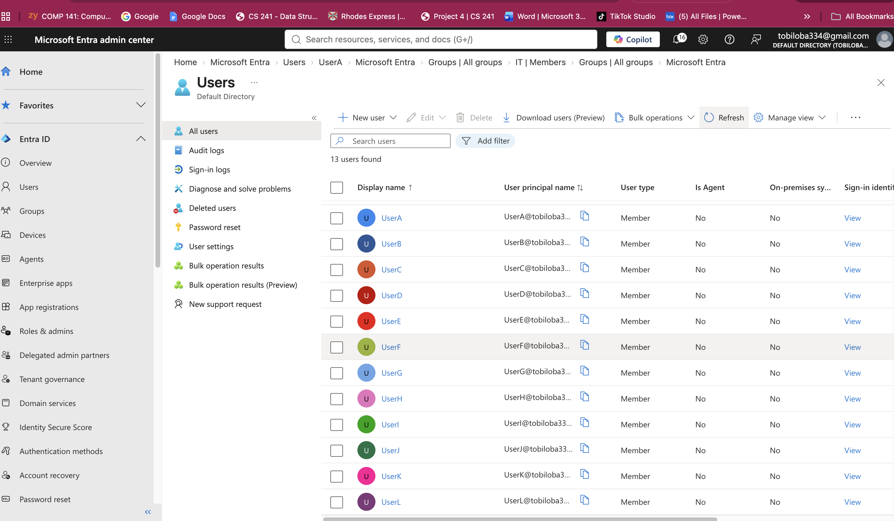
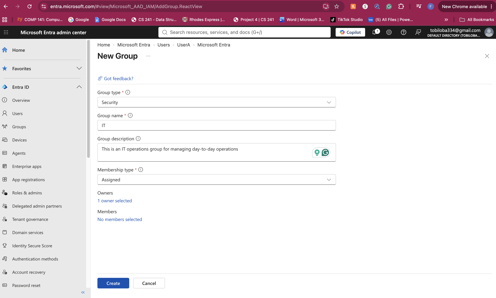
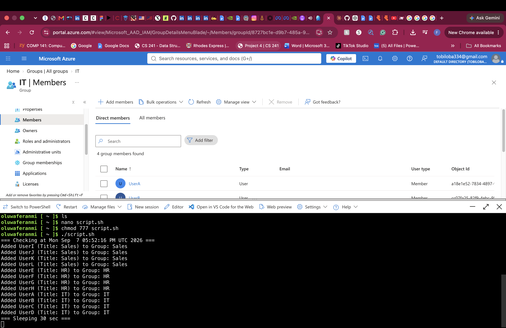
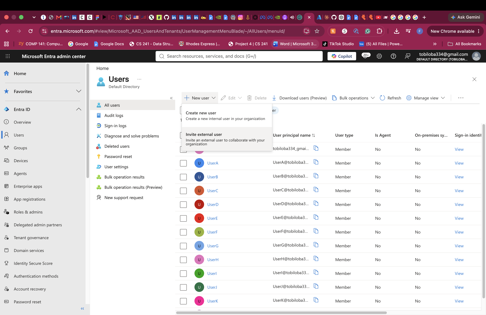
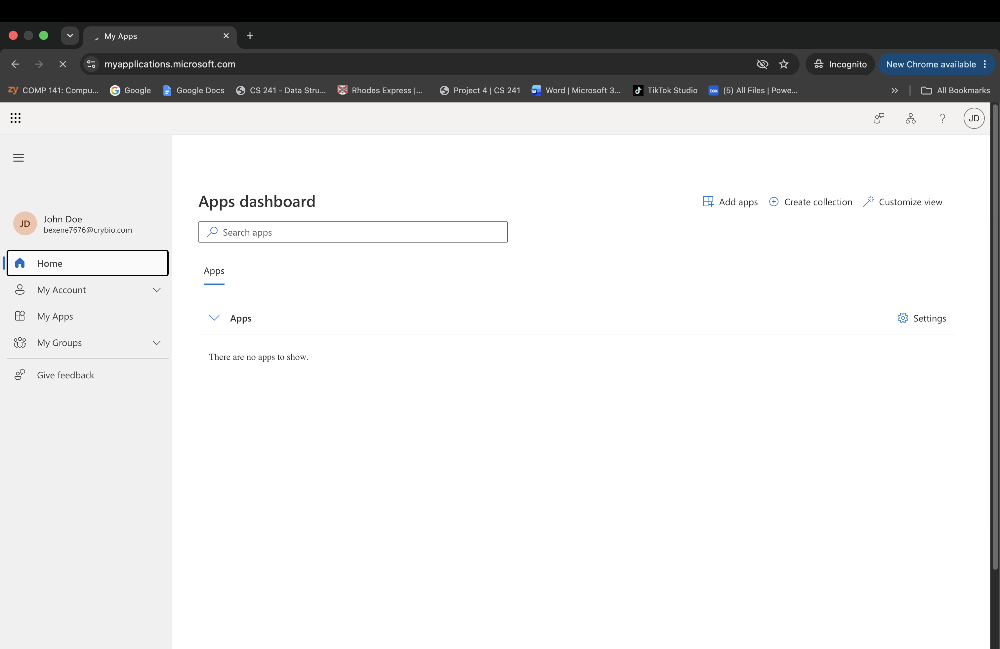
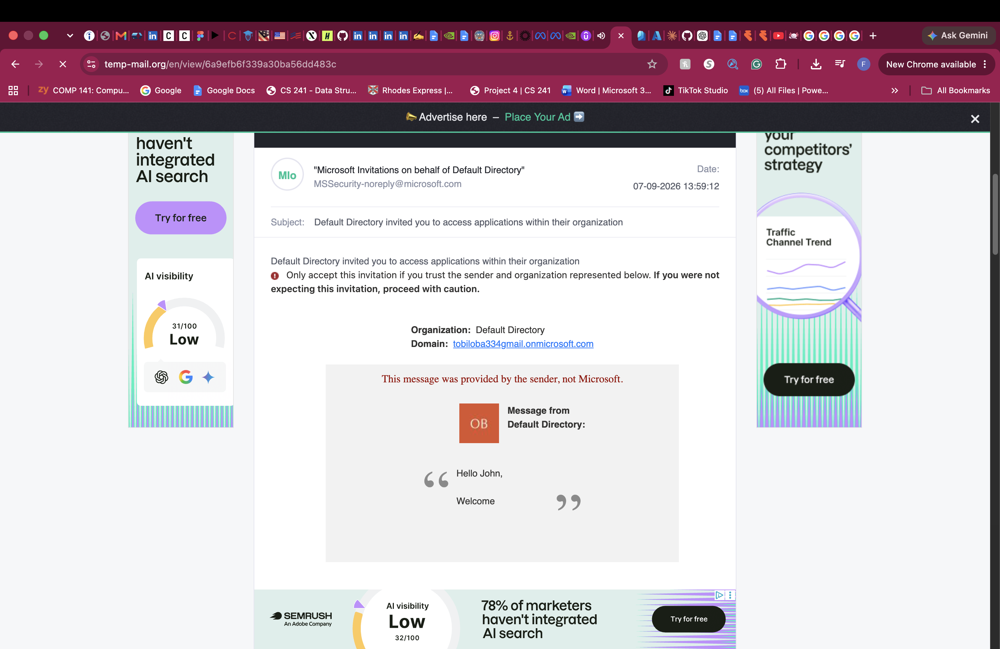
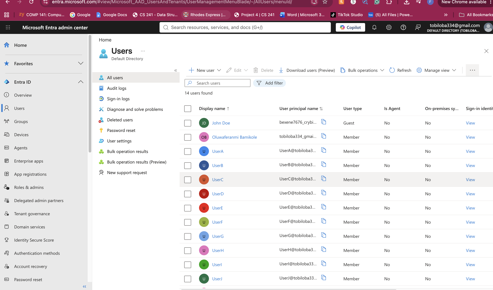
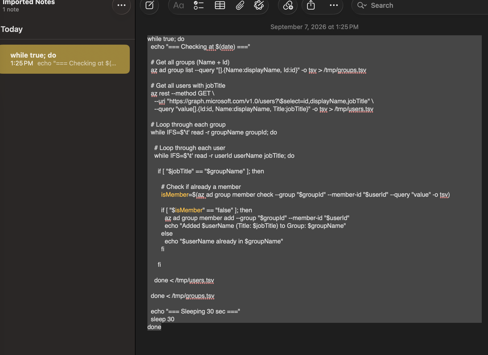

# Microsoft Entra ID — Fundamentals, Users & Groups

## What I did

Moved from on-premises Active Directory into Entra ID, Microsoft's cloud-native directory service. Created users and security groups, worked with dynamic group membership, invited an external user as a guest, and automated user/group creation with a script instead of clicking through the portal one account at a time.

## Steps

### Getting oriented in the Azure Portal and Entra admin center

Toured the Azure Portal and the Entra admin center to get a feel for where cloud identity management actually lives, separate from the on-prem AD tooling used throughout the rest of this lab.

### Creating users and security groups

Created users and a security group directly in Entra ID. Functionally similar to the on-prem side, but a different console, different object model, and no domain controller underneath it — this is Microsoft's own hosted directory, not something running on a VM I control.

### Dynamic membership rules — a genuinely cloud-native concept

On-prem AD groups are static: someone adds or removes a member manually, every time. Entra ID supports **dynamic groups** instead — define a rule based on user or device attributes (department, job title, and so on), and membership gets computed and maintained automatically. Someone whose attributes match the rule joins on their own; someone whose attributes change and no longer match leaves on their own. This removes ongoing manual membership management as an operational task entirely, and it's not something on-prem AD offers natively.

### Inviting an external user (B2B guest access)

Invited a user from outside the organization's own tenant as a guest, without creating them a brand new account in the directory. They authenticate with their existing identity — their own organization's Entra ID, or even a personal Microsoft account — and get scoped access into this tenant's resources instead. This is a fundamentally cloud-era capability with no real on-prem AD equivalent: cross-organization collaboration without duplicating identity management on either side.

### Automating user and group creation with a script

Rather than repeating the same manual clicks for every account, worked through Cloud Shell to automate Entra ID user and group provisioning from a script reading structured input instead of the portal. Same underlying principle as the on-prem PowerShell automation earlier in this lab — bulk operations driven from a data file rather than one-by-one manual entry — just applied to cloud identity this time instead of on-prem AD.

---

## Skills demonstrated

- Creating and managing users and security groups in Microsoft Entra ID
- Dynamic group membership rules based on user and device attributes
- Inviting external users via Entra ID B2B guest access
- Automating Entra ID user/group provisioning through Cloud Shell scripting
- Navigating the Azure Portal and Entra admin center as distinct tools from on-prem AD management
